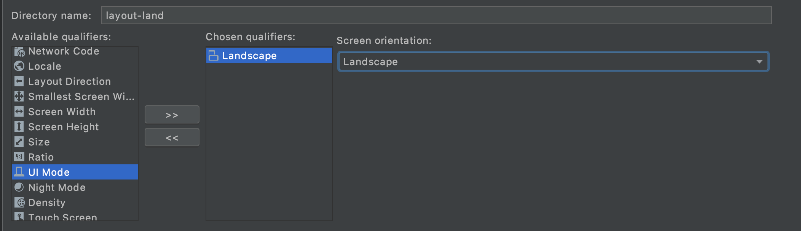
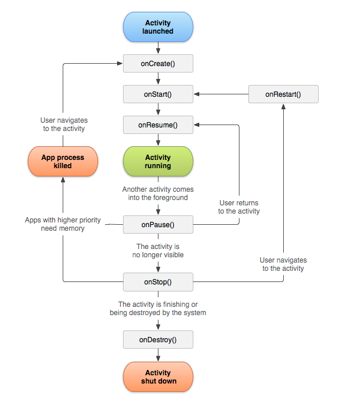

# SYM Labo 1

> Auteurs : Julien Béguin, Robin Cuénoud & Gaëtan Daubresse
>
> Date : 04.10.2020 

## Introduction 

L'objectif de ce laboratoire est d'effectuer des manipulation sur une application basique sur un smartphone Android. Cela nous permettra également de nous familiariser avec l'environnement de développement Android Studio. Nous avons choisit de le faire en Kotlin car ce langage deviendra sûrement le seul langage supporté sur Android.  

## 2. Premières constatations

### 2.1 Langue de l’interface

> *Sur Android, la langue des applications est automatiquement reprise de celle configurée au niveau de l’OS. Notre application reste en anglais quelle que soit la langue du système, votre première tâche sera de mettre place des traductions en français pour les chaines de caractères utilisées dans cette première activité.*

> *De plus vous expliquerez, dans votre rapport, quel est l’intérêt de regrouper les chaînes de caractères dans un fichier XML indépendant à côté des layouts.*

L'intérêt d'avoir toutes les textes regroupés dans un seul fichier et qu'il sera donc plus facile de traduire l'application dans une nouvelle langue puisque tous les textes sont connus et centralisé.

> *Vous expliquerez également comment organiser les textes pour obtenir une application multi-langues (français, allemand, italien, langue par défaut: anglais) ?*

Il suffit d'ajouter un nouveau fichier de type `Value Resource File` dans le dossier `res/values` en l'appelant `strings.xml` et en ajoutant le paramètre `Local` dans la langue qui nous intéresse (FR, DE, IT). Ensuite, il faut copier tous les balises du fichier `strings.xml` original et traduire les textes. Android se chargera alors de sélectionner le bon fichier de langue en fonction de la langue du système.

> *Que se passe-t-il si une traduction est manquante dans la langue par défaut ou dans une langue supplémentaire?*

Si une string est manquante dans une langue supplémentaire, la langue par défaut sera utilisé pour cette string. Mais si une string est manquante dans la langue par défaut, le build va échouer.

### 2.2 Champs textuel de saisie

> *L’activité comporte deux champs textuels de saisie, le premier va être utilisé pour accueillir une adresse e-mail, le second pour un mot de passe. Nous pouvons constater deux petits problèmes: dans les deux cas le clavier virtuel va activer l’aide à la saisie (correcteur orthographique) ce qui n’est pas réellement adapté à la saisie d’un e-mail et encore moins pour un mot de passe. Et le champ pour le mot de passe ne cache pas la saisie effectuée, nous souhaiterions que seuls de ∙ ou des \* soient affichés. Veuillez adapter la configuration de ces deux éléments d’interface utilisateur (UI) afin qu’ils proposent le comportement décrit ci-dessus. (Indice: inputType)*

Il suffit de changer `inputType` à `textPassword` pour le champs textuel du mot de passe ainsi que `textEmailAdress` pour le le champs de l'email.

### 2.3 Mode paysage

> *Si vous basculez votre téléphone en mode paysage, l’UI ne sera pas totalement adaptée et certains éléments,  comme  le  logo,  ne  seront  pas  affichés  correctement  (voir  Fig.  2a).  Votre  tâche  est  ici  de spécialiserle layout de cette première activité pour assurer un affichage adapté en mode paysage (voir un exemple sur la Fig.2b).*

Ici on doit copier le `layout` `activity_main` dans un nouveau `layout` qu'on définit être comme paysage puis réarranger les éléments. 



## 3. Gestion des événement set mise à jour de l’interface utilisateur

### 3.1.Vérification du format de l’e-mail

> *Lors de l’appui sur le bouton «Validate»,  dans  le  cas  où  les  deux champs  ont été  complétés,nous souhaitons dans un premier temps vérifier que l’e-mail saisi soit valide (nous nous limiterons dans le cadre de ce laboratoire à vérifier la présence du caractère @), dans le cas contraire vous afficherez un message d’erreur à l’utilisateur sous la forme d’un Toast*

Dans le fichier `MainActivity.kt`, ajouter le code suivant à la vérification des champs :

```kotlin
if (!emailInput!!.contains("@")) {
	Toast.makeText(applicationContext, "Invalid email", Toast.LENGTH_SHORT).show()
}
```

Cela permet de tester la présence du caractère `@` dans l'e-mail. Si ce n'est pas le cas, un toast indiquant l'erreur est affiché.

### 3.2. Vérification du couple e-mail / mot de passe

> *Si le format de l’e-mail saisi est valide, nous vérifierons ensuite si le couple (e-mail et mot de passe) saisi appartient à un utilisateur valide. Pour cela nous mettons à votre disposition, dans le code, la liste credentials contenant  des  couples  valides. Si  le  couple saisi n’est pas valide, nous afficherons à l’utilisateur un message d’erreur sous la forme d’une fenêtre de dialogue, si le couple est valide nous ouvrirons une nouvelle activité (dans la manipulation suivante).*

Toujours dans le fichier `MainActivity.kt`, ajouter le code suivant à la suite de la vérification de l'e-mail :

```kotlin
if (!credentials.contains(Pair(emailInput, passwordInput))) {
    AlertDialog.Builder(this).setMessage("Password incorrect").create().show()
} else {
    Toast.makeText(applicationContext, "Successful login", Toast.LENGTH_SHORT).show()
}
```

Cela permet de vérifier si la paire e-mail/mot de passe existe et d'afficher un message en conséquent.

## 4. Passage à une autre activité

### 4.1. Création et lancement de la nouvelle activité

> *La première manipulation va être de définir cette nouvelle activité dans Android Studio. Une activité est principalement composée de deux éléments : son code (une classe héritant d’Activity ou d’une de ses sous-classes, comme par exemple AppCompatActivity) et d’un fichier XML définissant son layout, l’activité devra être ensuite déclarée dans le fichier Manifest de l’application, sous peine de ne pas pouvoir être lancée. Android Studio permet d’automatiser la création d’une nouvelle activité, toutefois selon le type choisi,le layout automatiquement généré sera très complexe.Une fois l’activité ajoutée dans l’IDE, vous mettrez en place le code permettant de la lancer lors du succès du login.*

Sélectionner `new > Activity > Empty activity`.

### 4.2. Passage de paramètres à la nouvelle activité

>*Dans cette nouvelle activité, nous souhaitons afficher l’adresse e-mail utilisée pour le login. Vous allez donc devoir mettre en place le passage d’un paramètre à la nouvelle activité lors de son lancement et, dans celle-ci, la récupération de ce paramètre et son affichage.*

Dans MainActivity.kt, ajouter le code suivant lorsque l'e-mail et le mot de passe est validé :

```kotlin
// Start ContentActivity
val intent = Intent(this@MainActivity, ContentActivity::class.java)
intent.putExtra("email", emailInput)
startActivity(intent)
```

Puis dans ContentActivity.kt, ajouter le code suivante dans la fonction `onCreate()` :

```kotlin
val email = intent.getStringExtra("email")
val textView = findViewById<TextView>(R.id.textView).apply {
    text = email
}
```

Cela permet de passer l'e-mail de l'utilisateur à la nouvelle activité.

### 4.3. Permissions simples

> *Nous souhaitons à présent afficher une photo censée représenter l’utilisateur qui vient de se connecter, pour cela nous allons télécharger une image depuis Internet. L’accès à Internet n’est pas possible par défaut pour une application Android, celle-ci doit avoir la permission de le faire. Vous allez faire les modifications nécessaires dans le fichier Manifest pour autoriser votre application à accéder à Internet, ensuite vous utiliserez le code fourni permettant le téléchargement et l’affichage d’une image dans une ImageView:*

Il faut ajouter la ligne suivante dans fichier `AndroidManifest.xml` pour demander la permission d'accéder à internet :

```xml
<uses-permission android:name="android.permission.INTERNET" />
```

Puis, dans le fichier `ContentActivity.kt`, ajouter le code suivant pour récupérer des images aléatoires et les afficher dans la vue : 

```kotlin
ImageDownloader(findViewById<ImageView>(R.id.avatarView), "https://thispersondoesnotexist.com/image").show()
```

## 5. Navigation entre les activités

> *Nous souhaitons à présent ajouter une fonctionnalité permettant de créer de nouveaux comptes utilisateurs. Cette fonctionnalité prendra la forme d’une nouvelle activité, permettant de saisir et de valider une adresse e-mail et un mot de passe, ceux-ci seront transmis à l’activité principale lors du*
> *retour sur celle-ci.*

### 5.1 Création et lancement d'une activité 

> *Comme pour le point 4.1, vous allez commencer par définir une nouvelle activité et un layout associé. Cette activité, et son layout, sont très semblables à l’activité principale il est donc certainement possible de s’en inspirer ou même de réutiliser certains éléments. Cette activité permettra de saisir une adresse e-mail et un mot de passe, elle effectuera une validation de ceux-ci (sur la forme uniquement, comme pour le point 3.1, nous n’allons pas faire de vérifications additionnelles), et retournera le compte (couple e-mail / password) à l’activité principale qui l’ajoutera alors à la liste*
> *credentials . (Indice : Launching an activity for result).*

Pour implémenter cela on va ajouter dans `companion object` `private const val REGISTER_ACTIVITY = 1` qui sera la valeur de retour de l'activité register. Cela permet à l'activité `main` de savoir quelle activité a fini et lui retourne quelque chose. 

Dans `RegisterActivity` un intent est utilisé comme au préalable et la fonction `setResult` est appelée pour indiquer le retour de l'activité. Ici `RESULT_OK` est utilisé si le compte à correctement été crée. 

Dans `MainActivity` le résultat va être récupéré. Pour cela la fonction `onActivityResult` est override et va ajouter a `credentials` le couple `email/password` si tout c'est bien déroulé. L'activité `RegisterActivity` est lancée cette fois avec la fonction `startActivityForResult(intent,REGISTER_ACTIVITY)` qui se chargera d'appeler l'override de `onActivityResult`. Ici un `intent` qui ne contient comme donnée lui est passée et le code d'activité. 

### 5.2 Affichage d'une image 

> *Sur l’activité principale, une image vectorielle est affichée sur le haut de l’activité. Nous souhaitons mettre une autre image sur l’activité d’inscription. Pour cela vous pouvez choisir une image sur Internet (PNG ou JPEG), la télécharger et l’inclure dans les ressources de l’application afin de pouvoir*
> *l’ajouter au layout.*

> *Dans quel(s) dossier(s) devons-nous ajouter cette image ?*

Dans le dossier `res/drawable`

> *Veuillez décrire brièvement la logique derrière la gestion des ressources de type « image matricielle » sur Android.*

Lors de l'importation d'image matricielle, plusieurs tailles sont générés pour que l'application puisse afficher l'image au format idéal par rapport à la taille de l'écran.

> *Quel intérêt voyez-vous donc à utiliser une image vectorielle ? Est-ce possible dans tous les cas ?*

Les images vectorielles s'adapte automatiquement à la taille de l'écran. Il n'est donc pas nécessaire d'avoir plusieurs copie de l'image en taille différentes.

Néanmoins, ces images sont uniquement adapté au logos et graphisme mais pas au photos de par leur construction.

### 5.3 Factorisation du code

> *Vous remarquerez les très nombreuses similarités entre ces deux activités : le code de vérification et certains éléments de l’interface graphique. Nous souhaitons factoriser ce code pour en faciliter sa maintenance. Veuillez mettre en place une factorisation « simple » du code de ces deux activités (en Kotlin ou Java), vous commenterez votre approche dans votre rapport. Vous discuterez également des possibilités de factoriser des layouts, sans forcément le réaliser.*

Les classes `MainActivity.kt` et `RegisterActivity.kt` ont beaucoup de code en commun. Nous avons donc créé une classe `Auth.kt` qui est hérité par les deux classes et qui contient le code en commun.

Pour ce qui est des layouts, nous pourrions factoriser les groupes d'éléments de l'affichage. Par exemple le formulaire de connexion et le formulaire d'inscription sont similaires. Nous pourrions créer un "fragement" formulaire qui serait appelé dans les deux layouts.

### 5.4 Cycle de vie

> *Dans vos les trois activités, veuillez implémenter des sorties dans les logs pour les méthodes onCreate() , onStart() , onResume() , onPause() , onStop() , etc... qui marquent le cycle de vie d'une application Android. Décrivez brièvement à quelles occasions ces méthodes sont invoquées. Vous*
> *expliquerez aussi l’enchainement de ces appels lorsque l’on passe d’une activité à une autre. Comme pour le point 5.3, il est certainement possible de factoriser votre code pour réaliser cette étape.*

Les activités dans le système sont gérées de la même manière qu'une stack. Lorsqu'une activité démarre elle est généralement placée au sommet de la pile et est considérée comme l'activité en cours, l'activité précédente est placée en dessous de celle nouvellement créé. 

`onCreate()` : Cette méthode est appelée au début du cycle de vie de l'activité, cela correspond à sa construction. (start **entire lifetime**)

`onStart()` : C'est le moment ou l'activité devient visible dans l'application même si celle-ci n'est pas nécessairement au premier plan. (start **visible lifetime**)

`onResume()` : C'est le moment ou l'activité apparaît au premier plan. (start **foreground lifetime**)

`onPause()` : L'activité n'apparaît plus au premier plan. (end **foreground lifetime**)

`onStop()` : L'activité n'a plus de comportement visible sur l'écran. (end **visible lifetime**) 



[source]: https://developer.android.com/reference/android/app/Activity

